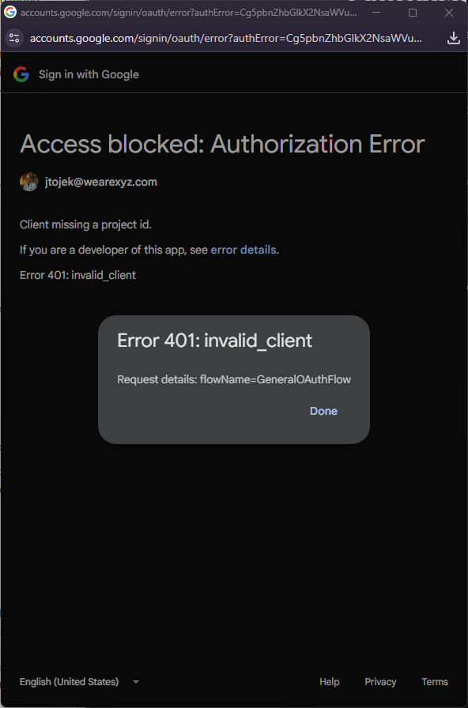
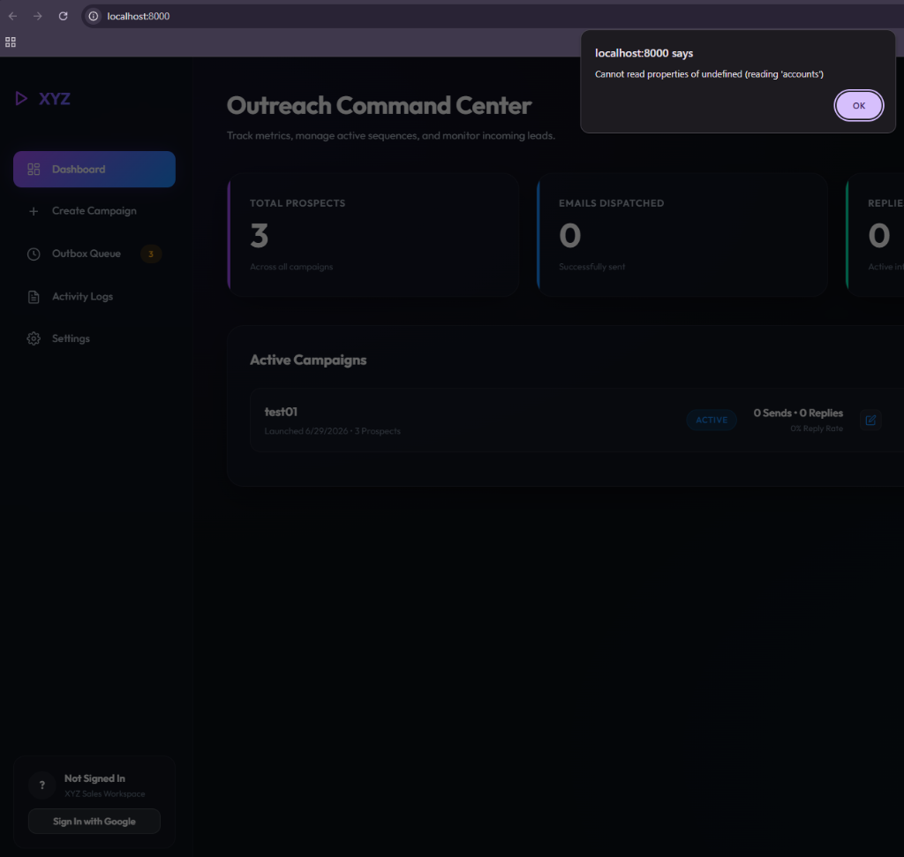
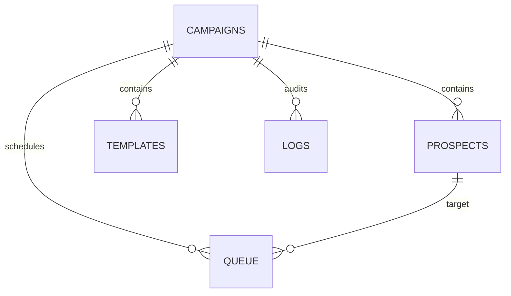

# 🚀 XYZ Sales Outreach Hub

[](#)
[](#)
[-orange.svg)](#)
[](#)

Welcome to the **XYZ Sales Outreach Hub**—a lightweight, privacy-first, browser-native outreach campaign manager and tracking dashboard designed specifically for the sales team at agency **XYZ**. 

This application runs **entirely in your web browser** and utilizes client-side database persistence (`IndexedDB`) and direct, secure Google OAuth2 APIs (Gmail & Google Sheets). This serverless architecture makes the application secure, completely free to operate, and ensures your team's and clients' data never touches a third-party server.

---

## 📸 Interface Preview

### 📊 Command Center Dashboard

*A sleek obsidian dark theme featuring glassmorphic counter meters, active campaigns overview, and a live chronological activity stream.*

### ✉️ Email Sequence Editor with Live Preview Selector

*An interactive split-screen editor where you can craft sequences, inject variable tokens, and preview personalized email variations for every contact using the dynamic recipient selector.*

---

## 🌟 Key Features

1. **Sleek, High-End Command Center:** A premium dark-themed dashboard featuring glowing glassmorphic meters (Total Prospects, Sends, Replies, Reply Rates) and a live, audit-trail style chronological activity stream.
2. **Flexible Spreadsheet Ingest:** Load lead lists instantly via local **CSV file drag-and-drop** or directly from **Google Sheets URLs** using your Google login.
3. **Multi-Step Template Editor:** An interactive split-screen editor to design automated follow-up sequences (e.g. *Initial Outreach* ➡️ *Follow-up 3 days later*).
   - **Personalization Tokens:** Inject variables like `{{Company}}` or `{{First Name}}` directly into subject or body lines.
   - **Interactive Live Preview Dropdown:** Use the dynamic recipient dropdown in the preview pane to cycle through all contacts on your list and inspect exactly what their personalized email looks like in real-time.
4. **Outbox Send Queue:** A review scheduler listing pending follow-up dispatches. Send single outboxes instantly, remove items from queue, or batch-dispatch the entire active outbox.
5. **Direct Gmail Threading & Auto-Pause:** Outbound follow-up emails are automatically grouped into the recipient's existing thread (using RFC 822 `In-Reply-To` and `References` headers) to keep conversations tidy.
6. **Automatic Reply Detection:** Scans active sent threads for responses. If a client reply is detected, subsequent automated follow-ups for that prospect are immediately paused to protect your client experience.
7. **100% Offline Mock Mode:** Test the entire app—CSV/Google Sheets imports, sequence designs, variables compiling, dispatch queues, dashboard analytics, and mock email reply cycles—instantly without configuring any Google credentials!

---

## 📁 Technical Architecture Summary

For future maintenance or customization, here is a quick overview of how the modular files interact:

- `index.html`: Holds the DOM outline for all single-page views, modal forms, and settings overlay.
- `css/styles.css`: Central stylesheet containing CSS variables (HSL-based), glassmorphic backdrop filters, custom scrollbars, layout alignments, and keyframe animations (fade-ins, glows, pulse states).
- `js/app.js`: Connects DOM events, handles routing, holds the in-memory draft state, and coordinates loading animations.
- `js/db.js`: Initializes IndexedDB. Manages CRUD operations for local browser data tables.
- `js/google-auth.js`: Dynamically loads the Google Sign-In script, initiates Google Identity Services (GIS) popups, and extracts security tokens.
- `js/sheets-service.js`: Calls Google Sheets metadata and grid endpoints to fetch columns.
- `js/gmail-service.js`: Packages emails into raw RFC 822 base64url packets, sends them via HTTPS POST, and decodes incoming threads.
- `js/sequence-engine.js`: The central core. Schedules delays, matches tokens, runs outboxes, and triggers reply detection.
- `js/csv-parser.js`: Parses local comma-separated text files. Handles embedded quotes and linebreaks.

---

## 🚀 Quick Start Guide

### Step 1: Launch the Local Server
Since the application uses ES6 modules, it must be served through a local HTTP server (rather than opening `index.html` directly as a local file).

Open your terminal in the repository directory and launch a lightweight server:
```bash
# Using Python (standard on most systems)
python -m http.server 8000
```

Now, navigate to:
👉 **[http://localhost:8000](http://localhost:8000)**

---

### Step 2: Test Instantly with Offline Mock Mode
When you open the app, it initializes in **Mock Mode** by default so you can immediately experience the product:

1. Click **Create Campaign** in the sidebar.
2. Enter a campaign name (e.g. `Q3 Performance Ads Pitch`).
3. Under *Load from Google Sheets*, paste this public spreadsheet URL to test real-time importing:
   `https://docs.google.com/spreadsheets/d/1QtOrgEPW1oTSZecaR3oyB2OEtN26CJsB9jyFxAbn0_0/edit?usp=sharing`
4. Click **Fetch Sheet**. (The app will query Google, parse the live columns, and display your target contacts in the *Recipient List Preview* grid).
5. Click **Customize Email Sequence**.
6. Design Step 1 and Step 2 emails. Try clicking on variable token chips like `{{First Name}}` and see them swap in real-time in the **Live Output Preview** panel. Use the **"To:" dropdown** in the preview pane to see how each email is customized for different people on the list.
7. Click **Launch & Queue Outreach**.
8. Go to **Outbox Queue**, review your scheduled follow-ups, and click **Process Send Queue** to watch the dispatches complete.
9. Click **Scan for Replies** to simulate incoming responses from interested prospects, then return to the **Dashboard** to watch your stats increment!

---

### Step 3: Transition to Live Enterprise Sending
When you are ready to send actual emails through your `@wearexyz.com` work account, follow these configuration steps:

#### 1. Setup a Google Cloud Project
- Go to the [Google Cloud Console](https://console.cloud.google.com).
- Create a new project (e.g., `XYZ Outreach`).
- Go to **Library**, search for and enable:
  - **Gmail API**
  - **Google Sheets API**

#### 2. Configure the OAuth Consent Screen
- Select User Type: **Internal** (this keeps the application private, ensuring only members within your organization can sign in).
- Add the following scopes:
  - `.../auth/gmail.send` (Send emails on your behalf)
  - `.../auth/gmail.readonly` (Read resources for reply-detection and threading)
  - `.../auth/spreadsheets.readonly` (Import prospects directly from Google Sheets)
  - `.../auth/userinfo.email` (Display active login session status)

#### 3. Create OAuth Client ID Credentials
- Go to the **Credentials** tab on the left sidebar.
- Click **Create Credentials** ➡️ **OAuth Client ID**.
- Application Type: **Web application**.
- Under **Authorized JavaScript origins**, click **Add URI** and enter:
  `http://localhost:8000`
- Click **Create** and copy your **Client ID** (it ends with `.apps.googleusercontent.com`).

#### 4. Connect the App
- In the Outreach Hub browser tab, click **Settings** (gear icon in bottom-left).
- Toggle **Offline Mock Mode** to **OFF**.
- Paste your **Google OAuth Client ID** into the box and click **Apply Configuration**.
- Click **Sign In with Google** in the sidebar. Once logged in, your sheets imports and send dispatches will run in **real-time** through your active Google account!

---

## 📊 Database Model (IndexedDB Schema)

To keep the application backend-free, all state is persistent across page loads using standard client-side `IndexedDB` under the database name `XYZ_Sales_Outreach_DB`.



- **`campaigns` Store**: 
  - Keys: `id` (auto-incrementing integer)
  - Structure: `{ name, status, mockMode, createdAt }`
- **`prospects` Store**: 
  - Keys: `id` (auto-incrementing integer)
  - Indexes: `campaignId`
  - Structure: `{ campaignId, email, name, company, variableData, status }`
- **`templates` Store**: 
  - Keys: `id` (auto-incrementing integer)
  - Indexes: `campaignId`
  - Structure: `{ campaignId, stepNumber, subject, body, delayDays }`
- **`queue` Store**: 
  - Keys: `id` (auto-incrementing integer)
  - Indexes: `campaignId`, `prospectId`, `status`
  - Structure: `{ campaignId, prospectId, stepNumber, subject, body, scheduledTime, status, messageId, threadId, error }`
- **`logs` Store**: 
  - Keys: `id` (auto-incrementing integer)
  - Indexes: `campaignId`
  - Structure: `{ campaignId, timestamp, type, message, details }`

---

## 🔧 Troubleshooting FAQ

> [!WARNING]
> **Error 401: invalid_client (Client missing a project id)**
> If Google displays this message when signing in, verify your credentials.
> - **Did you enter your email instead of Client ID?** The input box in Settings expects the long client identification string (ending in `.apps.googleusercontent.com`), *not* your work email address.
> - **Trailing Spaces:** Ensure no trailing spaces or formatting symbols are present in your pasted Client ID.

> [!TIP]
> **Dynamic Google Identity Services (GSI) Script Loader**
> If you start the application in Offline Mock Mode, the Google Login script is not loaded to maximize load speed and protect privacy. However, toggling Mock Mode off will automatically and dynamically inject the GSI script at runtime, ensuring seamless single-sign-on without requiring a full page refresh.

> [!NOTE]
> **Thread Integrity Constraints**
> Once a campaign has been launched, editing the campaign details will permit full modifications of your follow-up sequence templates, automatically re-compiling pending emails in the outbox. However, editing target rosters is locked to protect direct threading integrity and prevent duplicate client dispatches.

---

## 🛠️ Git Contribution & Push Playbook

If you are a developer preparing to merge updates and push code back up to GitHub:

1. **Verify Local Status**:
   ```bash
   git status
   ```
2. **Stage Uncommitted Assets**:
   ```bash
   git add .
   ```
3. **Commit Clean Refactorings**:
   ```bash
   git commit -m "refactor: optimize dynamic GSI script loader, complete campaign edit flow, and integrate live recipient preview dropdown"
   ```
4. **Push to Remote Repository**:
   ```bash
   git push origin main
   ```

---

## 🔒 Security & Privacy Compliance
- **Zero Third-Party Servers:** Your campaign data, prospect lists, templates, and Google credentials never leave your browser.
- **Client-to-Google Communication:** All API calls are executed directly from your browser to Google endpoints (`https://gmail.googleapis.com` and `https://sheets.googleapis.com`).
- **Workspace Domain Isolation:** By setting the OAuth consent screen to **Internal**, your Google Cloud project is entirely shielded from anyone outside the `@wearexyz.com` Workspace domain.
