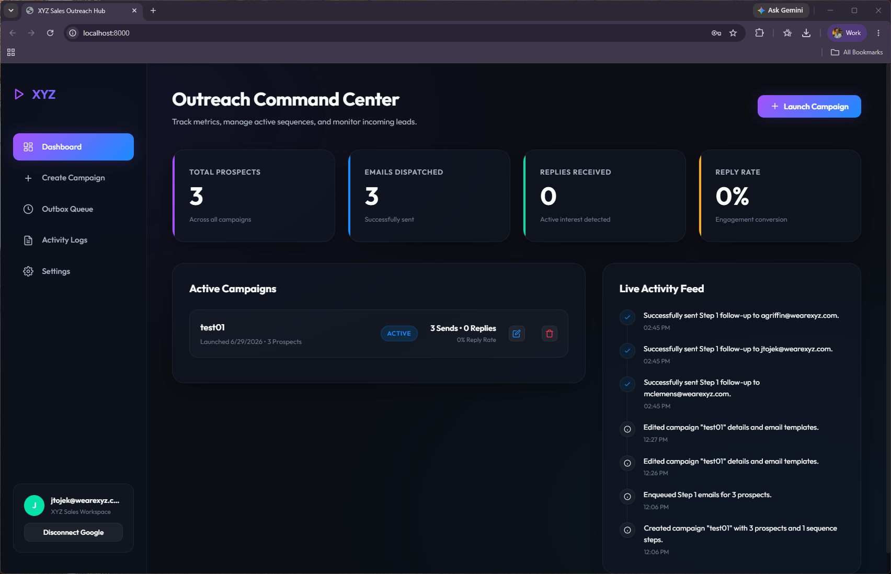
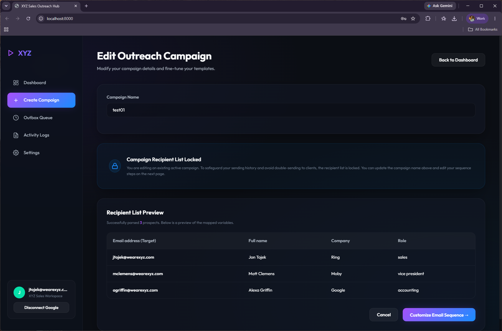
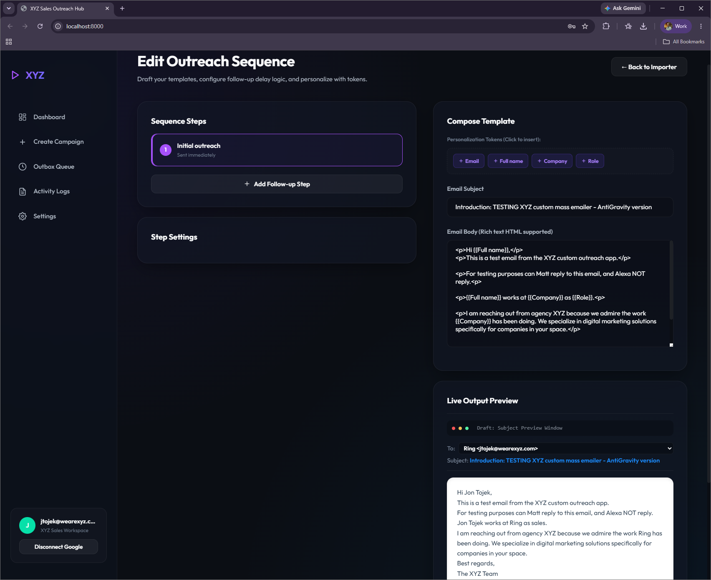
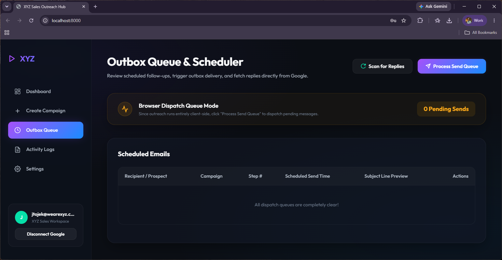
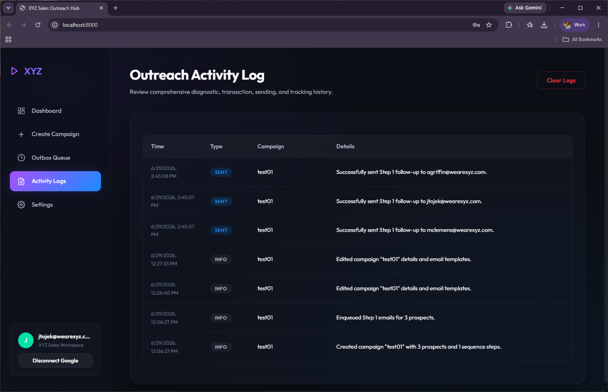
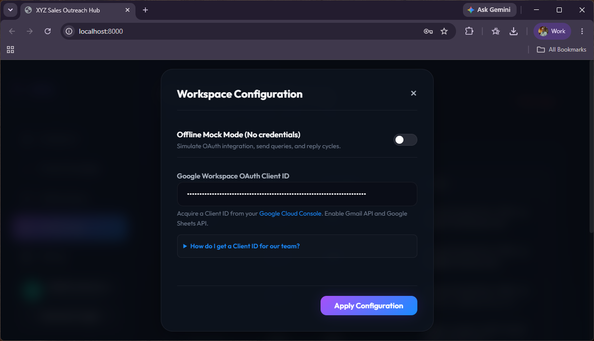

# ✉️ XYZ Sales Outreach Hub - User Guide

Welcome to your **Sales Outreach Command Center**! This tool lets you launch highly personalized, multi-step email outreach campaigns directly from your web browser using your active Google Account. 

All your campaigns, templates, and leads are saved securely in your browser's local database. No third-party servers see your data, ensuring total privacy.

---

## 📸 Overview & Quick Navigation
Here is how your outreach command center looks. Click through the sidebar to navigate:

* **Dashboard:** See your overall metrics, campaign statuses, active leads, and recent activity at a glance.
  
* **Create Campaign:** Import your target prospects from local files or Google Sheets with smart name-parsing.
  
* **Customize Email Sequence:** Craft multi-step plain-text follow-ups, insert variables, and preview drafts with your actual Gmail signature attached.
  
* **Outbox Queue:** Review scheduled follow-ups, watch the immersive dispatch cockpit HUD, and view historical sent logs.
  
* **Activity Logs:** View detailed logs of all sent emails, imports, and received replies.
  
* **Settings:** Connect your Google Account credentials and toggle Mock Mode for testing.
  

---

## 🚀 Quick Start Setup Guide (For Salespeople)

Running the outreach command center on your computer is simple. Follow the instructions for your operating system below:

### 📥 1. Download and Extract
1. Download the ZIP file containing the application.
2. Unzip/extract the folder onto your computer (e.g., your Desktop or Documents folder).
   > [!IMPORTANT]
   > Make sure to **fully extract** the ZIP file before running the application! Do not try to run it from inside the preview of a ZIP folder.

---

### 💻 2. How to Launch

#### 🪟 On Windows (One-Click Launch)
We have included a launch file so you don't have to type any terminal commands:
1. Double-click the file named **`start.bat`**.
2. This will automatically:
   * Open your web browser to the application page (`http://localhost:8000`).
   * Start the required background server.
3. Keep the small black terminal window open while you use the app! You can close it when you are done.

*If you prefer to start it manually via the terminal:*
1. Open **PowerShell** or **Command Prompt**.
2. Type `cd ` followed by the path to the unzipped folder.
3. Run: `python -m http.server 8000`
4. Open your browser and go to `http://localhost:8000`.

---

#### 🍎 On macOS (Apple/Mac)
We have included a launch file for Mac users as well:
1. Double-click the file named **`start.command`**.
2. *Note for first-time setup:* If Mac displays a permission/security warning:
   * Open the **Terminal** app (press `Cmd + Space`, type `Terminal`, and press `Enter`).
   * Type `chmod +x ` (make sure there is a space after `+x`), then **drag and drop** the `start.command` file from Finder into your Terminal window, and press **Enter**.
   * Now you can double-click **`start.command`** anytime to launch!
3. This will automatically:
   * Open your browser to `http://localhost:8000`.
   * Start the server. Keep the Terminal window open while you work!

*If you prefer to start it manually via the terminal:*
1. Open the **Terminal** app.
2. Type `cd ` followed by the path to the unzipped folder.
3. Run: `python3 -m http.server 8000`
4. Open your browser and go to `http://localhost:8000`.

---

## 🛠️ Step-by-Step Outreach Playbook

To launch your first personalized campaign, simply follow these 4 steps:

### Step 1: Prepare Your Google Sheets Lead List
Before opening the app, you need to create a Google Sheet containing your target clients.

1. **Set Up Your Column Headers:**
   Create a Google Sheet where the first row contains your column headers. You can use any column headers you like, but here is a standard example:
   
   | Email | Name | Company | ServiceOfInterest |
   | :--- | :--- | :--- | :--- |
   | jim@company.com | Jim Halpert | Dunder Mifflin | Paper Supply |
   | pam@agency.com | Pam Beesly | Scranton Design | Website Redesign |

   > [!TIP]
   > **Smart Name-Parsing:**
   > You don't need separate "First Name" and "Last Name" columns! The parser automatically extracts the first word of any `Name` or `Full Name` column to normalize the **`{{First Name}}`** token. If no name exists, it defaults to a professional `"Recipient"` standard so un-hydrated brackets never leak out.

2. **Make the Sheet Accessible:**
   - In Google Sheets, click the **Share** button in the top right.
   - Under *General access*, change it to **Anyone with the link can view** (this allows the app to fetch the columns instantly).

---

### Step 2: Create Your Campaign & Import Leads
1. Launch the app by opening: **[http://localhost:8000](http://localhost:8000)** in your browser.
2. Click **Create Campaign** in the sidebar.
3. Give your campaign a clear name (e.g. `Q3 Web Design Pitch`).
4. **Load Your Leads:**
   - Copy your Google Sheet's URL from the browser address bar.
   - Paste it into the **Load from Google Sheets** input box.
   - Click the blue **Fetch Sheet** button. (Or upload a local CSV).
5. Review the **Recipient List Preview** grid at the bottom to verify that all your contacts and columns loaded correctly.

---

### Step 3: Design Your Email Sequence
Once your contacts are loaded, click **Customize Email Sequence** to design your messages.

1. **Write Like a Human (No HTML Required):**
   - The sequence editor is a standard plain-text textarea. Simply type or copy-paste your emails naturally with standard returns.
   - The engine automatically compiles your plain text into beautiful HTML paragraphs with optimal spacing on dispatch.
2. **Insert Personalization Tokens:**
   - Place your cursor in the Email Subject or Email Body.
   - Click any of the **blue variable chips** above the editor (e.g. `{{First Name}}`, `{{Company}}`) to insert them into your text.
3. **Auto-Appended Signatures:**
   - On launch or tab load, the platform queries your authentic Gmail settings via Google OAuth, caches your actual configured email signature, and appends it to the bottom of all dispatches. (If in mock mode, it supplies a styled corporate fallback signature).
4. **Review with the Live Preview Selector:**
   - On the right-hand side, look at the **Live Output Preview** panel.
   - Cycle through different prospects in the dropdown to instantly see what their personalized emails and your actual signature will look like before queueing.
5. When you are happy with your templates, click **Launch & Queue Outreach**.

---

### Step 4: Run the Outbox Queue (Tactile Dispatch)
Your campaigns do not send emails automatically in the background. You have full manual control over when dispatches go out.

1. Click on **Outbox Queue** in the sidebar.
2. **Upcoming queue**: The **Scheduled Emails** list displays upcoming dispatches in an uncluttered layout, hiding scheduled times to focus on dispatch sequence.
3. **Verify content**: Click the **Subject Line Preview** or **Eye Icon** of any scheduled row. A high-contrast, reader-friendly white viewport displays your compiled email text and signature clearly, with quick-action buttons to **Send Now** or **Delete Send**.
4. **Process the Outbox**: Click the glowing **Process Send Queue** button to trigger the fullscreen **Transmission HUD Cockpit**:
   - Watch the central SVGs pulse and rotate.
   - Watch the current recipient's name **flash and glow** on screen with a tactile, elastic scale animation.
   - Track live horizontal progress meters and monospace terminal logs printing successful (`✓`) dispatches.
5. **Historical Logs**: Once successfully sent, items move instantly to the **Sent Emails Log** below. Click any sent item to verify exactly what was dispatched in a secure, read-only preview modal that hides action buttons to keep log records immutable.

---

## 👥 Live Campaign Prospects Directory
From the dashboard of any active campaign, you can manage your list on-the-fly without re-importing spreadsheets:
- **Add Prospect**: Click "Add Prospect" to load a dynamic modal that auto-discovers what variables (e.g. `Role`, `Company`) are active in your sequence templates and draws custom inputs for them. Submitting enqueues the prospect and schedules their Step 1 follow-up instantly.
- **Delete Prospect**: Click "Delete" on any directory row to remove them and trigger a cascaded deletion that cleans up any of their outstanding scheduled emails from your outbox queue.

---

## 📈 Tracking Results & Automatic Reply Pause

* **Dashboard Analytics:** Look at the glowing meters on your home dashboard to track your overall outreach health, reply rates, and total sends.
* **Scan for Replies:** On the **Outbox Queue** page, click the **Scan for Replies** button. The app will securely scan your inbox for any incoming client responses.
* **Auto-Pause Safety:** If a prospect replies to your email, **the app will automatically pause any subsequent scheduled follow-up steps for that prospect** so you can jump in and follow up manually without automated interference!
